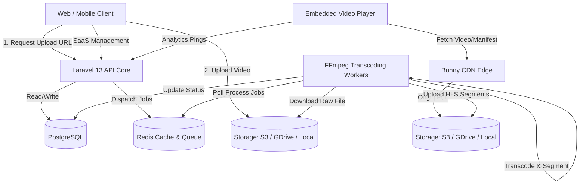
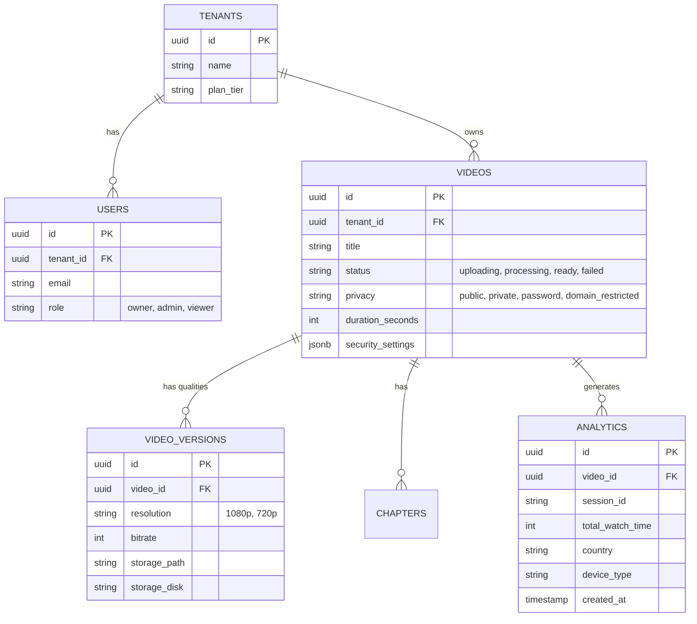
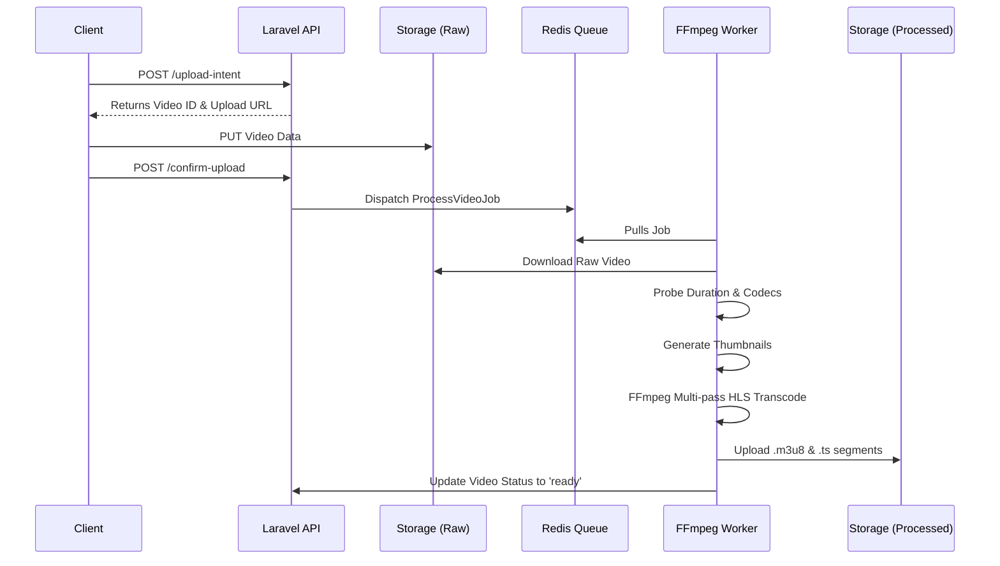

# Video Streaming SaaS Platform - System Architecture & Design

This document outlines the architecture for a production-grade video hosting and streaming platform inspired by Vimeo, Wistia, and Bunny Stream. The platform is designed for high scalability, multi-tenancy, and high-performance video delivery.

## A. High-Level System Architecture



### Tradeoffs & Decisions
* **Multi-Driver Storage Strategy:** Using Laravel's Flysystem allows seamless swapping of storage drivers (S3, Google Drive, Backblaze B2, Local). Free tiers (e.g., Google Drive via API) can be used for startups, while enterprise can use dedicated S3.
* **Direct-to-Storage Uploads:** Whenever supported by the driver (e.g., S3 presigned URLs), bypassing the API for file uploads prevents web server blocking. For drivers without direct-upload support, the API acts as a pass-through chunked uploader.
* **Separation of Storage:** Using distinct locations (buckets/folders) for Raw vs. Processed allows for strict lifecycle policies on raw files (e.g., delete 7 days after transcoding) while keeping HLS segments globally available via CDN.

---

## B. Service Breakdown & Responsibilities

1. **API Core Service (Laravel 13)**
   * **Responsibilities:** Auth, tenant management, metadata CRUD (videos, chapters, subtitles), generating signed URLs, dispatching queue jobs, and analytics ingestion.
2. **Ingest/Upload Service (Multi-Driver via Flysystem)**
   * **Responsibilities:** Highly reliable, resumable chunked uploads. Utilizes direct-to-storage URLs when supported (like S3), or API-proxied chunking for drivers like Google Drive or Local storage.
3. **Transcoding Worker Service (Laravel Horizon + FFmpeg)**
   * **Responsibilities:** Long-running background processes. Downloads raw video, extracts metadata (duration, codecs), generates thumbnails, and performs multi-bitrate HLS transcoding (240p to 4K).
4. **Delivery Service (Bunny CDN)**
   * **Responsibilities:** Edge caching of HLS segments (`.ts`, `.m3u8`), thumbnails, and static player assets. Enforces Token Authentication and Edge Rules (Domain restriction, hotlink protection).
5. **Analytics Aggregation Engine**
   * **Responsibilities:** Batches high-volume player pings via Redis, flushing to PostgreSQL asynchronously to avoid database locking.

---

## C. Database Schema Design



---

## D. API Design & Endpoints

A RESTful approach using JSON, secured via Laravel Sanctum (for SPA) and API Keys (for integrations).

* **Authentication & Tenants**
  * `POST /api/v1/auth/login`
  * `GET /api/v1/workspaces/current`
* **Video Management**
  * `POST /api/v1/videos/upload-intent` -> Returns Upload URL (Presigned or API proxy) & Video ID
  * `POST /api/v1/videos/{id}/confirm-upload` -> Triggers Transcoding Job
  * `GET /api/v1/videos` -> List videos (paginated)
  * `GET /api/v1/videos/{id}` -> Get metadata and HLS manifest URL
  * `PATCH /api/v1/videos/{id}` -> Update title, privacy, settings
* **Player & Delivery (Public/Edge)**
  * `GET /api/v1/player/{video_id}/config` -> Returns player UI config, chapters, subtitles, and Signed CDN HLS URL.
* **Analytics Ingestion**
  * `POST /api/v1/analytics/ping` -> Batched payload of play/pause/seek/heartbeat events.

---

## E. Storage Architecture (Multi-Driver)

The platform abstracts storage via Laravel's `Storage` facade, allowing the use of S3, Google Drive, Backblaze B2, or Local disks.

1. **Raw Uploads Disk (Private)**
   * Path: `tenant_id/raw_video_id.mp4`
   * Strategy: Move to cold storage (or delete) after transcoding.
2. **HLS Delivery Disk (Private Origin, Public via CDN)**
   * Path: `tenant_id/video_id/master.m3u8`, `.../1080p.m3u8`, `.../segment_001.ts`
   * Access: CDN Origin Pull points to this driver's public URL/API. Direct access is blocked.
3. **Assets Disk (Public)**
   * Path: Thumbnails, VTT Subtitles, Watermarks.

---

## F. Video Processing Workflow



---

## G. Security Architecture

* **Playback Authorization:** The Player requests a config from the API. The API verifies the Viewer's context (Domain Referer, Password, or Session). If valid, the API generates a **Bunny CDN Signed Token URL** valid for a short time window (e.g., 60 minutes) mapped to the viewer's IP address.
* **Domain Restrictions:** Enforced at two layers:
  1. API Layer (CORS and Player Config block).
  2. CDN Edge Rules (Validating the `Referer` header).
* **Hotlink Protection:** CDN Token Authentication ensures that even if someone copies the `.m3u8` link, it expires quickly and is tied to the original requesting IP.
* **Dynamic Watermarking:** Viewer IP or User ID is burned into the video visually via an overlaid HTML5 canvas element in the player, or for Enterprise, dynamically rendered at the edge.

---

## H. Analytics Architecture

* **Ingestion:** The custom React player sends a heartbeat `ping` every 10 seconds containing current time, buffered time, and state (playing, paused).
* **Buffering:** Laravel receives the ping and pushes it to a Redis List.
* **Processing:** A scheduled Laravel Job (e.g., running every minute) pops events from Redis and performs bulk `UPSERT` operations into PostgreSQL.
* **Aggregations:** Nightly cron jobs roll up raw ping data into `daily_video_stats` (total views, total watch time) for fast dashboard querying.

---

## I. Multi-Tenant Architecture

* **Database Level:** Every core table includes a `tenant_id`. Laravel's **Global Scopes** are utilized heavily. `Video::all()` automatically appends `WHERE tenant_id = current_tenant`.
* **Storage Level:** File paths are prefixed with `tenant_id` (e.g., `disk://tenant_uuid/video_uuid/...`). This allows for tenant-specific storage quotas, and even routing different tenants to different storage drivers (e.g., premium tenants on S3, free tenants on Google Drive).
* **Role Based Access:** Owner (billing, dangerous actions), Admin (manage videos & settings), Editor (upload only), Viewer (analytics only).

---

## J. Recommended Project Folder Structure

A polyrepo setup is recommended for independent scaling of frontend and backend.

**Backend (Laravel API - Domain Driven Design)**
```text
laravel-api/
├── app/
│   ├── Domains/
│   │   ├── Video/         # Models, Jobs (Transcoding), Observers
│   │   ├── Tenant/        # Billing, Workspaces, RBAC
│   │   ├── Analytics/     # Redis Aggregators, Rollups
│   │   └── Player/        # Signed URL generators, embed config
│   ├── Http/
│   │   └── Api/           # v1 Controllers
│   └── Console/           # Commands for maintenance
└── routes/
    └── api.php
```

**Frontend (React + TypeScript - Feature Sliced Design)**
```text
react-frontend/
├── src/
│   ├── features/
│   │   ├── dashboard/
│   │   ├── video-upload/  # Chunked uploader (direct or proxy)
│   │   ├── analytics/     # Recharts / Visx graphs
│   │   └── player/        # Core video player (Video.js or Hls.js wrapper)
│   ├── shared/
│   │   ├── ui/            # Buttons, Modals, tailwind components
│   │   └── api/           # Axios instance, React Query hooks
│   └── pages/             # Route containers
```

---

## K. Development Roadmap

* **Phase 1: Core MVP**
  * Storage abstractions (Local/GDrive), single-resolution MP4/HLS generation, basic React player, simple JWT auth.
* **Phase 2: SaaS Foundation**
  * Team/Tenant RBAC, multi-bitrate HLS (360p, 720p, 1080p).
* **Phase 3: Delivery & Security**
  * Bunny CDN Token integration, Domain Restrictions, Password protection, expiring links.
* **Phase 4: Advanced Player & Analytics**
  * Chapters, Subtitle (VTT) uploads, Playback speed, PiP, Redis-batched analytics, beautiful data dashboards.
* **Phase 5: Enterprise Scaling**
  * S3 integration, 4K Transcoding, Webhooks for integrations, API Keys, DRM (Widevine/FairPlay) packaging.

---

## L. Scaling Strategy

### 1,000 Users (The MVP)
* **API/Web:** Single VPS (e.g., 4GB RAM).
* **DB:** Managed PostgreSQL (Basic Tier).
* **Workers:** 1-2 dedicated FFmpeg worker nodes.
* **Bottleneck:** Transcoding queue delays if multiple users upload concurrently.

### 10,000 Users (Growth Stage)
* **API/Web:** 2+ Load-balanced web instances.
* **DB:** Primary DB + 1 Read Replica for heavy Analytics queries.
* **Workers:** Auto-scaling worker group triggered by Redis Queue depth.
* **Bottleneck:** Analytics write-heavy operations locking the database.

### 100,000 Users (Scale-Up)
* **API/Web:** Containerized (Kubernetes or ECS), horizontally scaling based on CPU.
* **DB:** PostgreSQL partitioning by `tenant_id` or date (for analytics).
* **Cache:** Redis Cluster for session state and high-throughput queueing.
* **Workers:** Spot instances for cheap, burstable FFmpeg transcoding.
* **Bottleneck:** Storage costs and CDN bandwidth.

### 1,000,000 Users (Enterprise)
* **Microservices Extraction:** Extract the Analytics engine out of Laravel into a dedicated Go/Rust service backed by **ClickHouse** or TimescaleDB instead of standard PostgreSQL for massive timeseries data.
* **Global Edge:** Multi-region API deployments to reduce latency for the Player Config request.
* **Transcoding:** Move from EC2 instances to dedicated hardware (GPU transcoding) or managed services like AWS MediaConvert for extreme scale and reliability.
